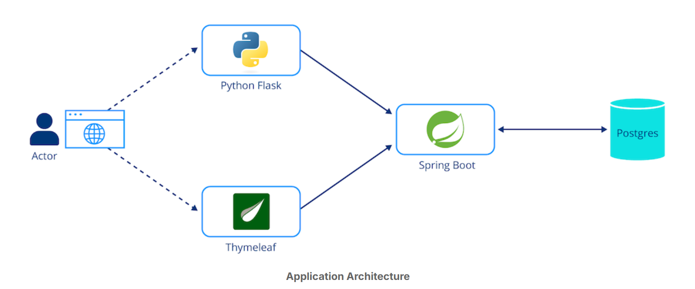
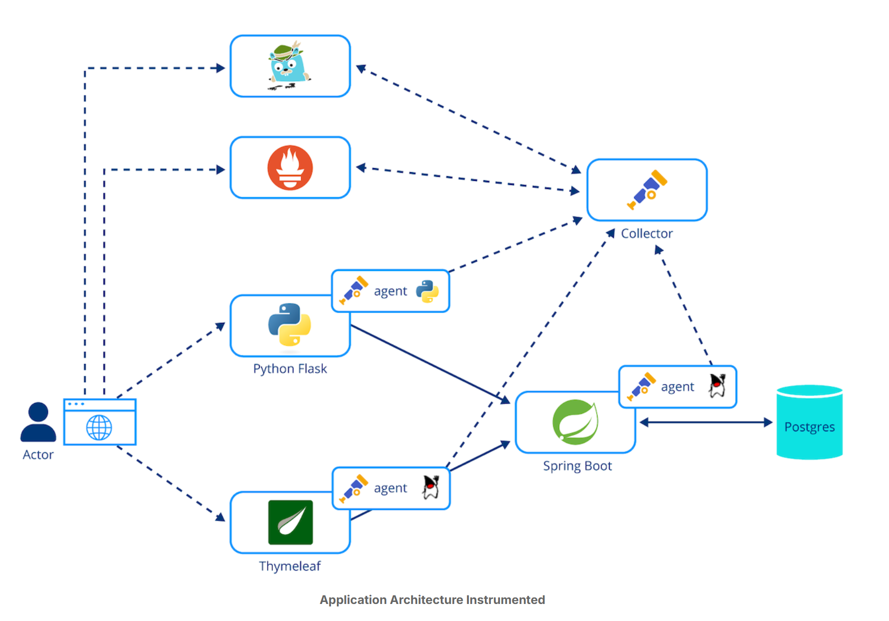

## 架构

下图解释了*上机实验室中使用的示例应用程序的架构：OpenTelemetry in Action*：

- 该应用程序由多语言分布式组件组成，可执行待办事项列表这一简单任务。

- - 主要组件是使用 Spring Boot 框架以 Java 实现的 REST 服务器，它使用 Postgres 数据库进行持久化
  - 指向该服务器的一个前端组件是使用 [Thymeleaf](https://www.thymeleaf.org/) 框架用 Java 编写的。
  - 使用 Flask 框架用 Python 编写的另一个前端也指向该后端
  - 有一个简单的负载生成器，它不断向前端组件发送请求

-  OpenTelemetry agent已对应用程序组件进行了检测

- 所有收集到的信息都被发送到 OpenTelemetry collector

- OpenTelemetry Collector可将信息导出到各种第三方应用程序中

- - 将（分布式）traces 导出到 Jaeger 实例中
  - 指标导出到 Prometheus 实例中

